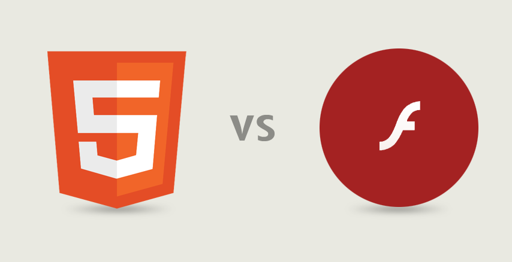

title: HTML5
author:
  name: Falusi David
  twitter: falusi94
  github: kreaturexyz
style: style.css
output: slides.html

--

# HTML

--

### HyperText Markup Language

<br/>
<center>
    Előre definiált **tagekből** áll, melyek leírják a dokumentum **tartalmát** pl.: `<html>`
    <br/>A HTML dokumentumokat weboldalnak szoktuk hívni.
</center>

--

### HTML - oldal struktúrája

```html
<!DOCTYPE html>
<html>
  <head>
    <meta charset="utf-8" />
    <title>Hi everyone!</title>
  </head>
  <body>
    <div>Some awesome content!</div>
  </body>
</html>
```

--

# HTML
## Block & inline elements

--

### HTML - Block elements

<br/>
<center>
`<div>` `<h1>` `<h2>` `<h3>` `<h4>` `<h5>` `<h6>` `<p>` `<form>`
</center>

--

### HTML - Inline elements

<br/>
<center>
`<span>` `<a>` ``
</center>

--

### HTML - None elements

<br/>
<center>
`<style>` `<meta>` `<head>`
</center>

--

### CSS kitekintés

- `display: block;`
- `display:inline;`
- `display:none;`

--

<!-- HTML5 image -->

--

### HTML5
<center>
Új tagek kerültek bevezetésre<br/>
Teljes CSS3 támogatás<br/>
Video és audio támogatás<br/>
2D/3D grafika<br/>
Local storage<br/>
Local SQL database
</center>

--

### Szemantikus web

<br/>
<center>
`<article>` `<aside>` `<details>` `<figcaption>` `<figure>` `<footer>` `<header>` `<main>` `<mark>` `<nav>` `<section>` `<summary>` `<time>`
</center>

--

### Szemantikus web

``` html
<html>
...
    <div id="content">
      <div class="header">
        <span>Profil és Körök</span>
      </div>
    <div id="data">
      <span id="pagemessages"></span>
...
    <div id="footer">
      <div id="footercont">
        <div class="logocont">
...
  </body>
</html>
```

--

<!-- New semantic tags image -->

--

### Form attribútum típusok

<br/>
<center>
`number, date, time, calendar, range`
</center>

--

<!-- Advanced html5 -->

--

### Multimédiás elemek

<br/>
<center>
`<audio>` `<video>` `<iframe>`
</center>

--

### Multimédiás elemek



--

### Video tag

```html
<video width="1280" height="720" controls autoplay>
  <source
    src="media/bbb_sunflower_1080p_60fps_normal.mp4"
    type="video/mp4">
  Your browser does not support the video tag.
</video>
```

<center>
  <video width="400" controls>
    <source src="http://distribution.bbb3d.renderfarming.net/video/mp4/bbb_sunflower_1080p_60fps_normal.mp4" type="video/mp4">
  Your browser does not support the video tag.
  </video>
</center>

--

### Audio tag

```html
<audio controls>
  <source src="media/horse.mp3" type="audio/mpeg">
Your browser does not support the audio element.
</audio>
```
<br/>

<center>
  <audio controls>
    <source src="media/horse.mp3" type="audio/mpeg">
  Your browser does not support the audio element.
  </audio>
</center>

--

### Grafikus tagek

<br/>
<center>
`<svg>` `<canvas>`
</center>

--

### HTML canvas

```html
<canvas id="myCanvas" width="600" height="400"
  style="border:1px solid #000000;">
</canvas>
```
<center>
  <canvas id="myCanvas" width="600" height="400" style="border:1px solid #000000;">
  </canvas>
  <input id="clear" type="button" value="clear"/>
  <input id="kirdev" type="button" value="draw"/>
</center>

--

### Új API-k
  - HTML Geolocation
  - HTML Application Cache
  - HTML Web Workers
  - HTML SSE
  - HTML Drag and Drop
  - HTML Local Storage

--

### Drag n drop

```js
function allowDrop(ev) {
    ev.preventDefault();
}

function drag(ev) {
    ev.dataTransfer.setData("text", ev.target.id);
}

function drop(ev) {
    ev.preventDefault();
    var data = ev.dataTransfer.getData("text");
    ev.target.appendChild(document.getElementById(data));
}
```

--

### Drag-n-drop

<center>
  <div id="rect" style="width:200px;height:200px;padding:10px;border:1px solid #aaaaaa;"></div>
  <br>
  
</center>

--

<!-- Local storage -->

--

# Kérdések?

--

# Köszönöm a figyelmet!


<script>
  var c = document.getElementById('myCanvas');
  var ctx = c.getContext('2d');

  // bind event handler to clear button
  document.getElementById('clear').addEventListener('click', function() {
    ctx.clearRect(0, 0, c.width, c.height);
  }, false);

  // bind event handler to draw button
  document.getElementById('kirdev').addEventListener('click', function() {
    // vertical line
    ctx.moveTo(300,0);
    ctx.lineTo(300,400);
    ctx.stroke();
    // bottom half circle
    ctx.beginPath();
    ctx.arc(300,400,200,Math.PI,0);
    ctx.stroke();
    // upper quater circle
    ctx.beginPath();
    ctx.arc(300,0,200,Math.PI/2,Math.PI);
    ctx.stroke();
    // upper rigt half circle
    ctx.beginPath();
    ctx.arc(400,100,100,3*Math.PI/2,Math.PI/2);
    ctx.stroke();
    // upper hotizontal line
    ctx.moveTo(300,1);
    ctx.lineTo(400,1);
    ctx.stroke();
    // lower horizontal line
    ctx.moveTo(300,200);
    ctx.lineTo(400,200);
    ctx.stroke();
  }, false);

  document.getElementById('rect').addEventListener('dragover', function(ev) {
    ev.preventDefault();
  });

  document.getElementById('rect').addEventListener('drop', function(ev) {
    ev.preventDefault();
    var data = ev.dataTransfer.getData("text");
    ev.target.appendChild(document.getElementById(data));
  });

  document.getElementById('draggable').addEventListener('dragstart', function(ev) {
    ev.dataTransfer.setData("text", ev.target.id);
  });

</script>
