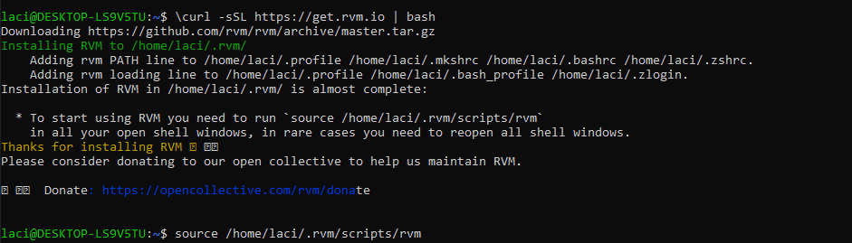
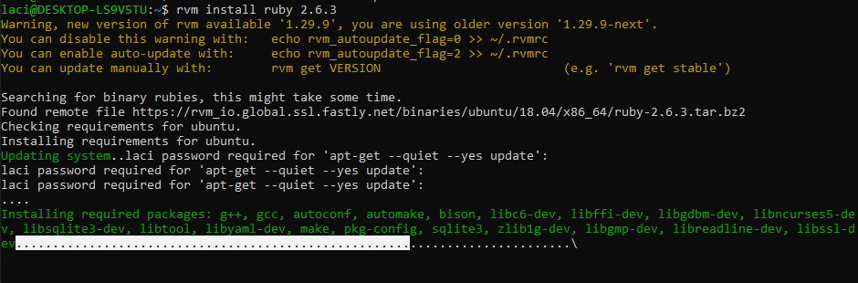
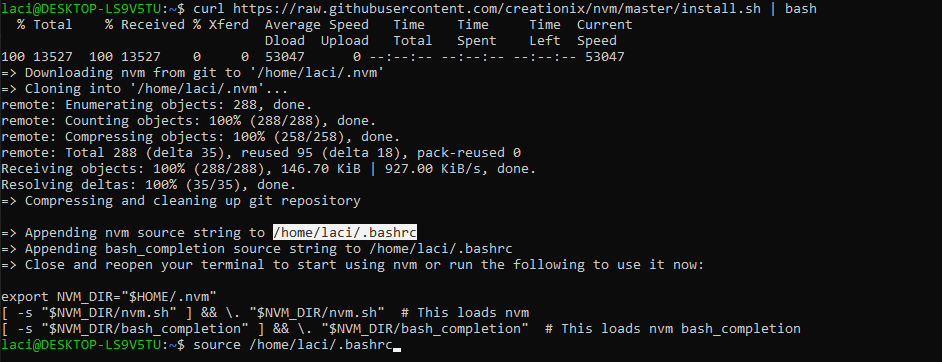
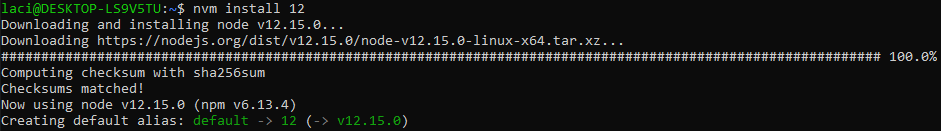
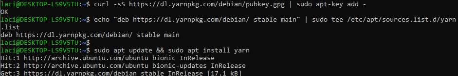
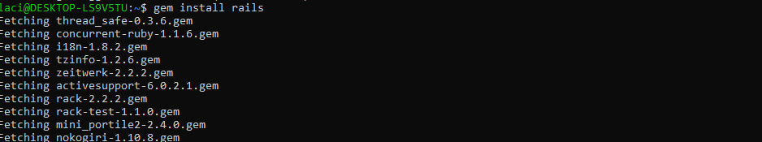
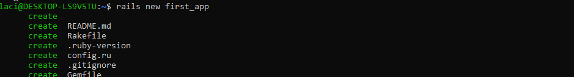
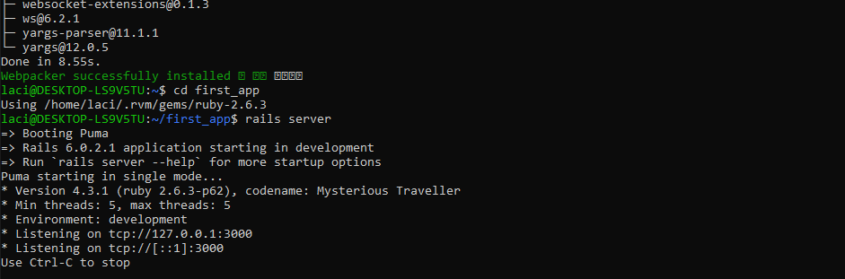
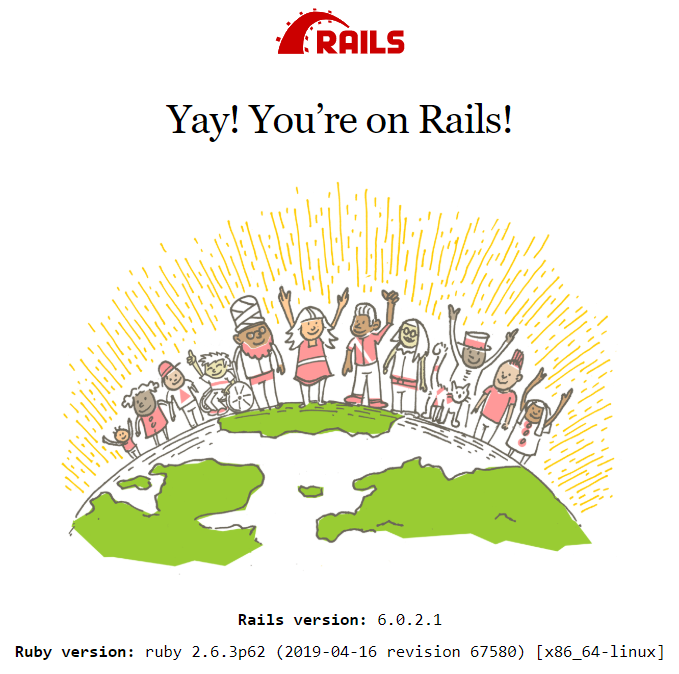

# Ruby és Rails telepítés

**Megjegyzések:**
- a source parancsokban a file elérési útvonalakban a 'laci' lecserélhető $USER -re, az általad megadott felhasználónévnek kell ott szerepelnie


**Telepítendő alkalamzások:**
- Ruby: https://www.ruby-lang.org/ 
- NodeJS: https://nodejs.org/en/
- YARN: https://classic.yarnpkg.com/en/
- Rails gem: https://rubyonrails.org/

 **Opcionális alkalmazások:**

 A Rubyt és a NodeJS-t több módón is lehet telepíteni. Mi Version Managerek használatát javasoljuk:
- RVM: https://rvm.io/
- NVM: https://github.com/nvm-sh/nvm
  
**Telepítés Linuxra**

Az alábbi parancsok Ubuntu 18.04-en semmilyen előzetes konfiguráció nélkül lefuttathatók.

**Telepítés Windows10-re**

A parancsok egy Windows Subsystem for Linux (WSL) alkalmazásban használhatók. Javasolt WSL:

- Ubuntu 18.04 LTS: https://www.microsoft.com/store/productId/9N9TNGVNDL3Q

**Parancsok:**
```sh
\curl -sSL https://get.rvm.io | bash
```
letölti és telepiti az RVM (Ruby Version Manager) alkalmazást, amin keresztül majd letölthető az adott ruby verzió 
```sh
source /home/$USER/.rvm/scripts/rvm
```
betölti az új csomag funkcióit a nyitott terminálba



```sh

rvm install ruby 2.6.3
```
a telepítés során meg kell adni a felhasználóhoz tartozó jelszót
ha megakad, akkor enter spamelésével (többszöri lenyomásával) lehet továbbhaladni

telepíti a 2.6.3 -as verzójú ruby-t 



```sh
curl https://raw.githubusercontent.com/creationix/nvm/master/install.sh | bash
```
telepíti a NVM (Node Version Manager) alkalamzást
```sh
source /home/$USER/.bashrc   
```
betölti az új csomag funkcióit a nyitott terminálba  



```sh
nvm install 12
```
telepíti a kiválasztott NodeJS-verziót



```sh
curl -sS https://dl.yarnpkg.com/debian/pubkey.gpg | sudo apt-key add -
echo "deb https://dl.yarnpkg.com/debian/ stable main" | sudo tee /etc/apt/sources.list.d/yarn.list
```
Yarn letöltése
```sh
sudo apt update && sudo apt install yarn
```
Yarn (függőség kezelő) telepítése




```sh
gem install rails
```
Rails gem telepítése
Building native extensions. This could take a while... felirat nem hazudik, tényleg eltarthat kb 5 percig is,míg továbbhalad a telepítés



```sh
rails new first_app
```
létrehoz egy új Rails projectet a first_app mappában
ez is eltarthat kb 5 percig



```sh
cd first_app
```
átváltja a munka mappát a first_app mappára 
```sh
rails server   
```
elinditja a Rails servert, ami a böngészőben a localhost:3000 -es címen tekinthető meg







