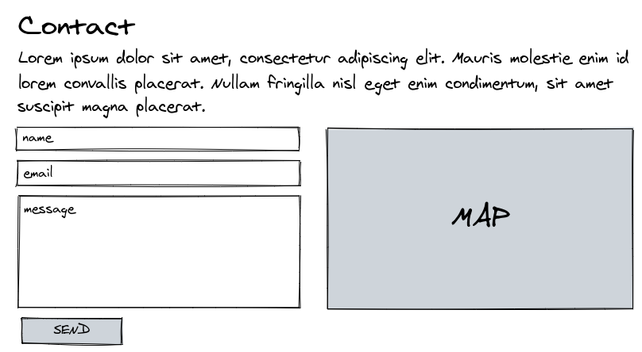

# Web alapozó workshop feladatok

A feladat során egy landing page template-ből kell dolgozni. A template Tailwind CSS-t használ, melynek a dokumentációját az alábbi linken keresztül érhetitek el.

https://tailwindcss.com/docs/installation


## 1. Feladat

Clone-ozd/töltsd le az alábbi linken található git repository-t!
https://github.com/ammezie/tailwind_landing_page

## 2. Feladat

A felső menüsávban található linkeket állítsd be úgy, hogy az *index.html*-re mutasson a *Home*, az *about.html*-re mutasson az *About* és a *contact.html*-re mutasson a *Contact* link. 

A szüksgéges file-okat hozd létre!

> :warning: ** HASZNÁLJ RELATÍV ÚTVONALAKAT! **

<details><summary>:question: Segítség</summary>
<p>

Az `a` HTML tag `href` attributuma segítségével adható meg a link.

Például:
```html
<a href="pages/about-us.html">About us</a>
```
</p>
</details>

## 3. Feladat

Helyezd el a felső menüsávot és a láblécet mind a három oldalon!

## 4. Feladat

Készítsd el az *About* oldal tartalmát a kapott wireframe alapján!

### Wireframe


## 5. Feladat

Készítsd el a *Contact* oldal tartalmát a kapott wireframe alapján! A térképhez használj [OpenStreetMap](https://www.openstreetmap.org)-et.


<details><summary>:question: Segítség</summary>
<p>
OpenStreetMap -> Megosztás gomb -> HTML
</p>
</details>

### Wireframe



---

## 6. IMSC Feladat :thinking: 

Az elkészített form ténylegesen küldjön egy email-t a megadott paraméterekkel az e-mail címedre!


<details><summary>:question: Segítség</summary>
<p>
A feladat megoldásához szükség lesz JavaScript használatára.
</p>
<p>
Több ingyenes e-mail küldő szolgáltatás is el érhető (például SendinBlue).
</p>
</details>