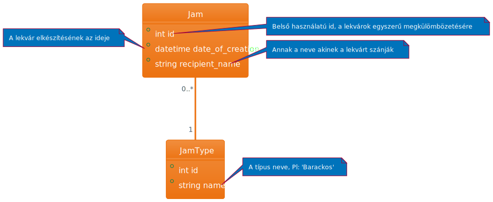

# Ruby on Rails tanfolyam


<!-- _color: white -->
<!-- _paginate: false -->
## 1. alkalom

---

# Mivel foglalkozunk a körben?

- PéK (Profilok és Körök)
- TanulóSCH
- SCH-PINCÉR
- Gólyakörte portál
- és amúgy még sok más...

---

# Mi ezekben a közös?

Mindegyik **adatvezérelt rendszer**

*konyhanyelven:* Valamilyen adatforrással dolgozik, és a tárolt adattól függően dinamikusan viselkedik.

---

# Ruby on Rails

Előnyök:

- Gyors fejlesztés (scaffolding)
- Opinionated
- Convention over Configuration (**konvenció:** megszokás / nem hivatalos szabály)
- Nagy választék előre megírt könyvtárakból ( *gem* :gem:)

Hátrányok:

- Kompatibilitás verziók között ( pl gemeknél )
- Ruby magic
- Teljesítmény (de legtöbb webappra így is tökéletes)

---

# Demo projekt

## User story

Marika néni megynerte a lottót, és minden pénzét befőzni való gyümölcsre költötte. Szeretné karban tartani az elkészült lekvárokat egy alkalmazásban, ahol eltárolná minden egyes lekvárról a **típusát** (a.k.a. milyen gyümiből van), a **készítés dátumát** és az unokájának/szomszédnak a **nevét**, akinek készítette.

## Egyszerűsítések

- Marika néni a 90-es évek elején kezdte használni a netet, és nem jönnek be neki a mai túlcicomázott oldalak. Pusztán funkcionalitást akar. (~~**css**~~)

- Marika néni respektálva van az egész világon, senki nem merne illetéktelenül belenyúlni az oldalába. (~~**authorizáció**~~)

---

<!-- _header: Egyszerű modell diagram -->


---

# Live coding in progress


---

# Ruby nyelv alapjai

- Objektum orientált nyelv
- Dinamikusan típusos
- Szimplicitásra tervezve (na ez nem mindig jött össze)
- JIT -> nem fordul gépi kódra a futás előtt

---

# Változó deklarálása
  
  ```ruby
    # Lokális szám típusú változó
    var = 1
    # Lokális string típusú változó
    var2 = "hello there"
    
    # Globális változó
    $var3 = "Globális string"
   ```

---

# Metódus / Függvény definiálása

```ruby
def say_hi(name) # Metódus
    puts "Hello #{name}"
end
# függvény meghívása
say_hi "world"
```

``` ruby
def add(a, b) # Függvény
    a + b # implicit return
end

def mul(a,b = 1) # Alapértelmezett érték
    return a * b # explicit return
end
# meghívás
add 3, 2
mul 3, 2
mul 3 # nem kell b-t megadni, ha alapértelmezett
```

---

# Példa egy osztályra

```ruby
    class Greeter
        def initialize(name = "world") #konstruktor
            @name = name
        end

        def say_hi 
            puts "Hi #{@name}!"
        end
    end
```

használata:

```ruby
greeter = Greeter.new("Kir-Dev")
greeter.say_hi #=> "Hello Kir-Dev!
```

---

# Magyarázat

*Változók*:

```ruby
@variable # Objektum változó

@@static_variable # Osztály szintű statikus változó
```

**Nem kell előre definiálni, elég csak értéket adni nekik**

*String interploation:*

```ruby
text = "Hello #{@name}!"

text = "Hello " + @name + "!" 
```

---

# Tömbök

```ruby
tomb = [1,2,"Három",:january] #Bármit is tud tárolni

first_element =  tomb[0] # 0-tól indexeltek
first_element =  tomb.first

last_element = tomb.last

out_of_bound = tomb[123] # exeption helyett NIL

tomb.length # 4

tomb.sort # Ha csak összehasonlítható elemek vannak benne
 ```

---

# Elágazások

```ruby
if feltétel then
    #do something
elsif feltétel then
    #do other thing
else
    #do third thing
end

```

## Boolean konvenció

Minden függvény ami boolean értéket ad vissza ?-el postfixelünk. Célja, hogy olvashatóbb legyen a kód.

pl: `user.admin?` `array.empty?` `array.include?`

---

## Iterációs függvények

```ruby
5.times {|i| puts "#{i}. iteráció"} # 0-tól 4-ig végig iterál
```

```ruby
tomb = [1,2,3,5,8,13,21]

tomb.each {|num| puts num} # Kilistázza a tömb elemeit

tomb.select {|num| num % 2 == 0} # Kiválasztja a páros elemeket

tomb.map {|num| num**2} # mindegyik számot négyzetre emeli
```

**Ranges**:

```ruby
(1..5).each {|i| ... } # iteráció: 1,2,3,4,5

(1...5).each {...} # iteráció 1,2,3,4

```

---

# Alternatív szintaxis

**Több parancsból álló blokk**:

```ruby
tomb.each do |n|
    gyok = Math.sqrt(n) # Első parancs
    if gyok < 4 # Elágazás
        puts n # Második parancs
    end
end
```

---

# Hash map

- Kulcs érték tárolására alkalmas
- Nagyjából megfeleltethető egy JSON objektumnak => gyakran használt Rails-ben
- Bármilyen objektum tárolható (még másik hash tömb is)

```ruby
dictionary = {one: "egy", two: "kettő"}

puts dictionary[:one] #egy
puts dictionary[:three] #nil
```

---

# Nil és a Symbol

## nil

- maga is objektum
- legfontosabb függvénye `.nil?`

## symbol

- `:valami` szintaxissal hozható létre
- Leggyakrabban Hash kulcsként használjuk
- Gyorsabb

---

# Kérdések?

---

# Kir-Dev újoncest

- **Március 18 16:00-tól az SCH 1319-ben**
- sör, pizza, társas stb...
- gyertek sokan!
