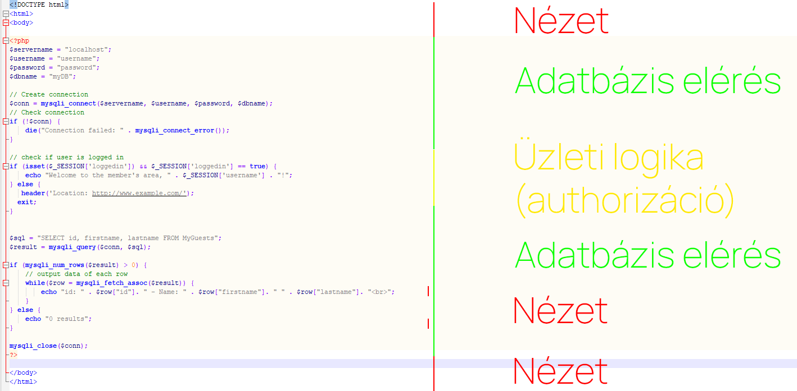
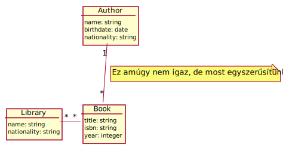
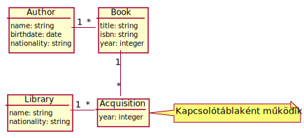

# Ruby on Rails tanfolyam

<!-- _color: white -->
<!-- _paginate: false -->
## 2. alkalom

### Rails projekt felépítése  és MVC

---
<!-- _footer: image from medium.com-->

---

# MVC - Háromrétegű architectúra

 Alapvetően grafikus felhasználói felületek (GUI) átláthatóbb programozására és a flelősségek szétválasztására kitalált **design pattern**

Később a webes világban terjedt el a használata, az olyan keretrendszereknek köszönhetően mint a *Spring*, *Django* és a **Rails**

## MVC a rails-ben

- **Model:** Adatbázis elérés és *Object-relational mapping*
- **View:** User interface-t leíró fájlok (HTML, JSON, CSV...)
- **Controller:** Endpointok által "meghívott" függvények (akciók)

---

# Model

- ORM: *Active Records*
- OOP objektumok SQL(vagy NOSQL) nyelvre történő átfordítása
- Enitások közti kapcsolatok leírása
- Entitások validálása
- Üzleti logika egy része itt valósul(hat) meg

---

# View

- A felhasználónak leküldött adatok megjelenítése
- Alapértelmezetten *Embeded Ruby Templating* (erb)
- A válasz lehet JSON is (jbuilder), vagy akár mindkettő
- A rails beépítve kezeli a javascript és css/scss kiszolgálását

---

# Controller

- Üzleti logika másik része itt valósul meg
- *Filterekkel* lehet befolyásolni az oldal viselkedését
  - Ha a felhasználó nincs bejelntkezve vezessen át a login oldalra
  - Ellenőrizze, hogy van-e jogosultsága megnézni az oldalt
- Hozzáfér a http kérés paramétereihez
  - Sütik
  - Routing params: (/client/:client_id/status)
  - Query params: (/client_status?id=123)

---

# Miért jó ez nekünk?

- Üzleti logika elszeparálható a kinézettől
- Adatbázis independens a kód (mindegy hogy PostgeSQL, MySQL vagy MongoDB)
- Az egyes rétegek kicserélhetők a többi réteg átírása nélkül (majdnem)
- Könnyebb automatizált tesztelés (A rétegek külön tesztelhetők)
- Karbantarthatóbb

---

# Egy (eltúlzott?) példa: PHP

---

## Felmerülő kérdések

- Mi van ha adatbázis séma megváltozik, hány helyen kell átírnom az SQL lekérdezést?
- Látjátok benne hol formázhatom meg a lekérdezés eredményét?
- Mi van ha elgépelem az oszlop nevét? Nincs IntelliSense, nem szól nekem.
- SQL injectionre könnyen sebezhető lehet, ha kézzel hozom létre a lekérdezést.
- 1000 soros kódot senki sem olvas szívesen.

 *Persze PHP-ban is vannak keretrendszerek, itt most csak az MVC design pattern előnyeit emelem ki, nem a php-t szidom!*

---

# Fontos fájlok egy Rails projektben

## (Nem teljes lista, különösebb sorrend nélkül)

- **Gemfile:** A felhasznált könyvtárak (gemek) listája
- **db/schema.rb:** Adatbázis séma leírása
- **db/migrate/*.rb:** Migrációs fájlok (Adatbázis séma megváltozását írják le)
- **config/routes.rb:** Az oldal végpontjait köti hozzá a kontrollerek függvényeihez
- **config/database.yml:** Az adatbázis kapcsolat leírása az ActiveRecords-nak
- **app** Az alkalmazásunk kódja nagyrészt itt van

---

# Az *App* mappa tartalma

- **controllers:** Kontrollerek fájljai 🤨
- **models:** Modellek fájljai
- **views:** Nézetek fájljai
- **helpers:** Segédfüggvények
- **javascript:** JS és (S)CSS fájlok

Van még több is, de ezeket használjuk a legtöbbször

---

# Példaprojekt

Egy könyvtár adminisztrációs rendszer 3 entitással: **könyvtár**, **könyv** és  **szerző**.
A projekt nagyrésze megvan, elérhető a githubon <https://github.com/kir-dev/rails-tanfolyam-2022-example>.
A feladatunk készíteni egy statisztikát kiszolgáló oldalt, ahol kíirjuk:

- Egy adott könyvtárban az összes fellelhető szerző nevét
- Egy adott könyvtárban az összes X-edik évben beszerzett könyvet
- Összes magyar szerző könyvét, akinek külföldi könyvtárban is van könyve

---

## Modell v1

##### `has_and_belongs_to_many`

---

<!-- _class: lead -->
## Modell v2

### `has_many :through`

---

# Live coding in progress

---

# Kitérő: Hogyan lehet könnyen webes keretrendszert megtanulni?

- Találj ki egy egyszerű projektet
- Kezd el leprogramozni (google és dokumentáció segít)
- ????
- Profit

---

# Kitérő: Kir-Dev mentor program

**Kiknek szól?** -> Akik szeretnének csatlakozni újoncként a körhöz, de még nincs ötletük melyik projekthez, vagy még nincsen magabiztos tudása a webfejlesztéshez.

**Mi lesz benne?** -> Workshopok, újoncprojektek, segítség ha valahol elakadsz.

**Hol jelentkezz?** -> Emailben kapsz form linket, utána gyere el gyűlésre és ismerkedj meg a Kir-Dev csapatával.

---

# Kir-Dev újoncest

- Március 18 16:00-tól az SCH 1319-ben -> **Ez holnap lesz!**
- sör, pizza, társas stb...
- gyertek sokan!

---

# Kérdések?

Köszönöm a figyelmet!
